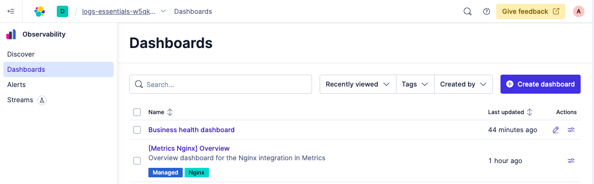
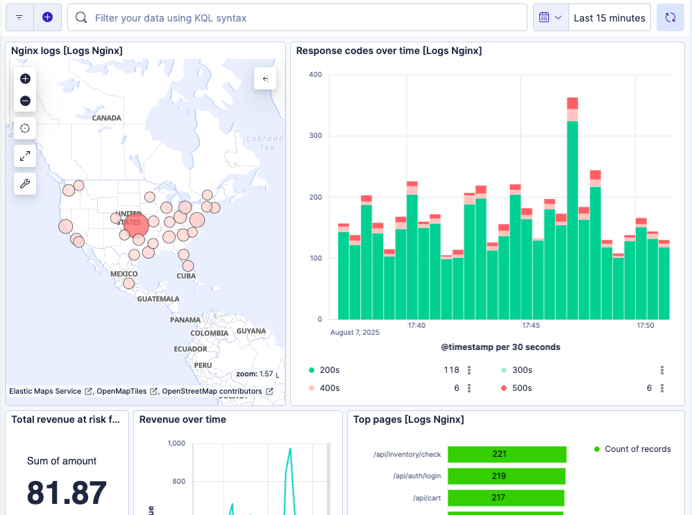
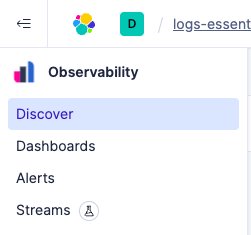
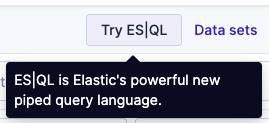
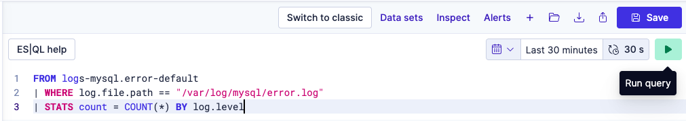
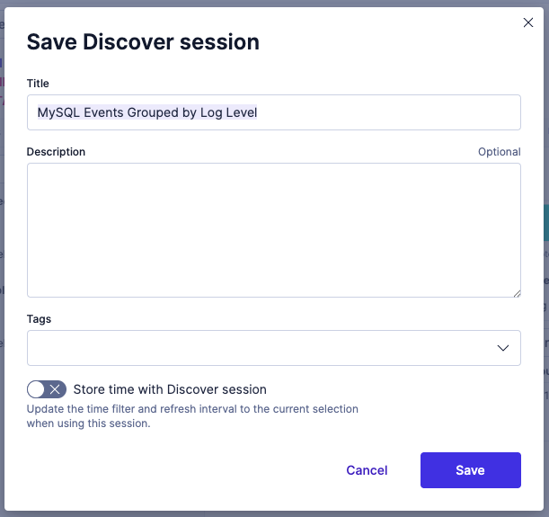
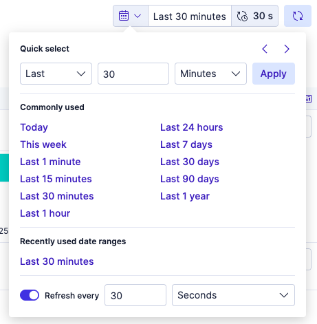

# Elastic Observability Logs Essentials Workshop

Welcome to the Elastic Observability Logs Essentials Workshop. This is our chance to dive hands-on into logs, alerts, and real-time troubleshooting. We will learn how to monitor, explore, and resolve issues faster using Elastic Observability powered by the Search AI Platform.

We’ll start by getting familiar with the environment behind the logs.

## Environment Overview

To analyze logs effectively, we need to understand what is generating them. In this section, we will explore the architecture of a sample eCommerce application running on Kubernetes.

We are looking at Elastic Observability Logs Essentials managing an eCommerce application deployed on Kubernetes. It has three tiers:
- A frontend served by NGINX
- A backend, also on NGINX
- A MySQL database

Refer to the diagram for a visual of how everything connects.


> [!NOTE]
> The Elastic Agent is deployed as a sidecar in each pod to collect logs.

We now have a clear picture of the application stack and how logs are collected. With this foundation in place, we are ready to explore logs with the context needed to make smart decisions.

## Business Health Dashboard

Let's  start by checking the overall health of the business using a dashboard that visualizes critical metrics.

1. Open the `Dashboards` page.

2. Select the `Business Health Dashboard`.
3. Feel free to explore the dashboard for trends, spikes, or anything that stands out.  The environment should look healthy right now.

The Business Health Dashboard connects operational signals to business outcomes. It helps us track metrics like geographic distribution of users, HTTP status codes, top web pages, and SQL performance, all derived from logs. This kind of visual insight lets us spot issues before they impact customers.

## Discover Logs

Next, we will confirm that MySQL logs are being ingested and check for any existing errors.

1. Navigate to `Discover`.

2. Click on `Try ES|QL` to switch to ES|QL mode, which allows us to perform queries using ES|QL syntax.

3.  Run this query (this query will show a breakdown of the count of each log level for logs from `/var/log/mysql/error.log`):

```sql
FROM logs-mysql.error-default
| WHERE log.file.path == "/var/log/mysql/error.log"
| STATS count = COUNT(*) BY log.level
```
4. Confirm that the results show no errors.

5. This query will be useful later in the workshop, so let's save it by clicking `Save`.

6. Give the Discover session a name of `MySQL Events Grouped by Log Level` and click `Save`.
```text
MySQL Events Grouped by Log Level
```

> [!NOTE]
> You can search over a different time range using the time range selector.
> 

We confirmed that logs from MySQL are flowing correctly and that there are no current issues. Saving this ES|QL query allows you to revisit it anytime without having to rewrite it, making it easy to compare changes over time.

## Summary
We now have an understanding of the eCommerce application, verified that the environment is healthy, and saved an ES|QL query to be used later.
