## 🚨 Red Alert 🚨

Oh no! An alert has just fired, signaling a spike in MySQL error logs. Let's will investigate the alert and examine the related log events.

1. Click on `Alerts` to view the active alerts.
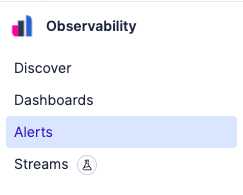
> [!NOTE]
> If the alert isn't visible yet, refresh the page.
2. Click on the `...` to see more actions for the alert.
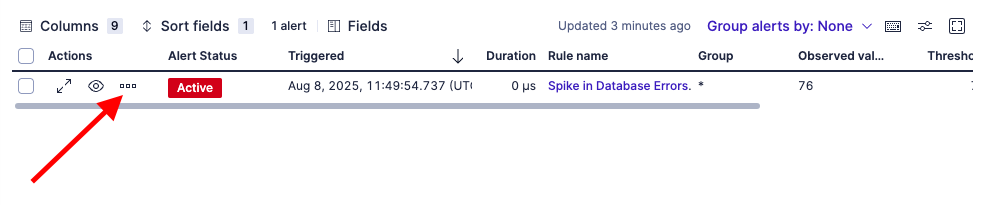
3. Click on `View alert details` to see the details of the alert.
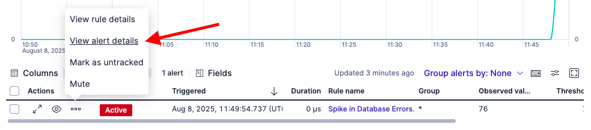
4. This is a custom threshold alert that we created to catch unknown issues.  It's not looking for any specific issue, but rather, it's configured to fire when there are more events than our expected threshold.  Notice how it shows the number of events have exceeded our baseline threshold of 70.
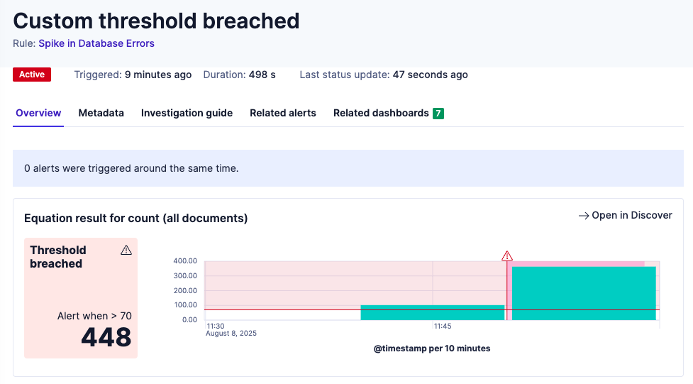
5. Click `Open in Discover` to see the related logs on the `Discover` page.
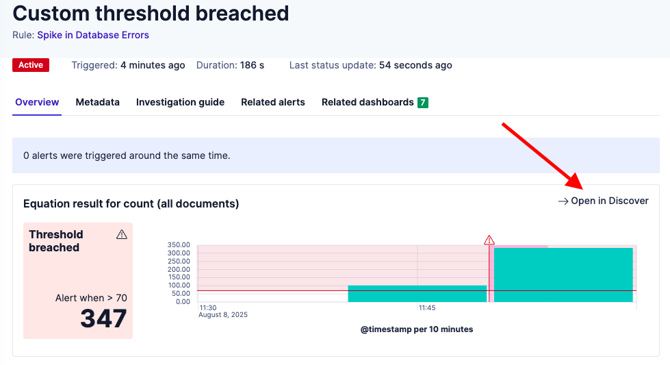
6. On the `Discover` page, we can now see relevant logs for the alert automatically filtered alert time range. This makes it easy to ensure we're looking at the right logs for this event.
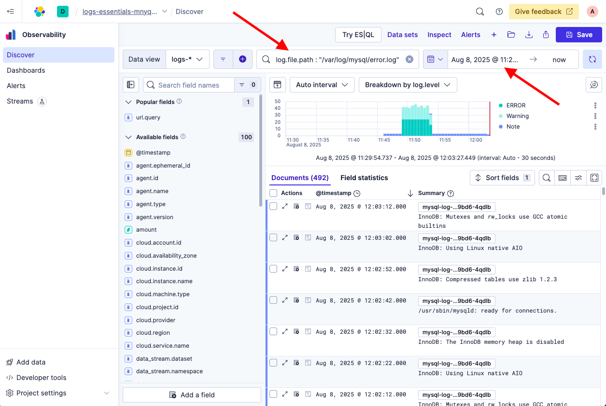

We were able to go from alert to relevant logs in just a few clicks. Elastic links alerts to their underlying data, helping us act faster with the right context in front of us.

## Rerun the Saved Query

To see how conditions have changed, we will run the same MySQL query we saved earlier.

1. Navigate back to `Discover`.
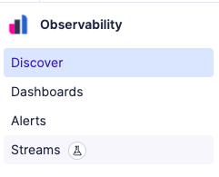
2. Click the `Open Session` icon.
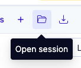
3. Select the `MySQL Events Grouped by Log Level` session that we saved earlier.
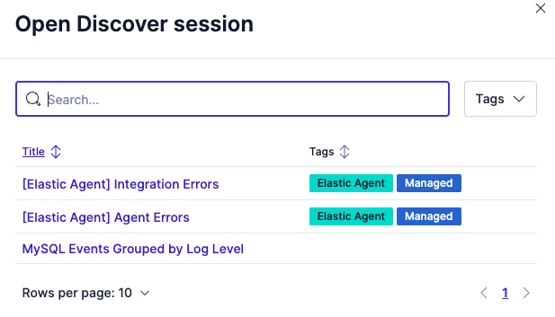
4. We should now see confirmation that there are now numerous errors and warnings.
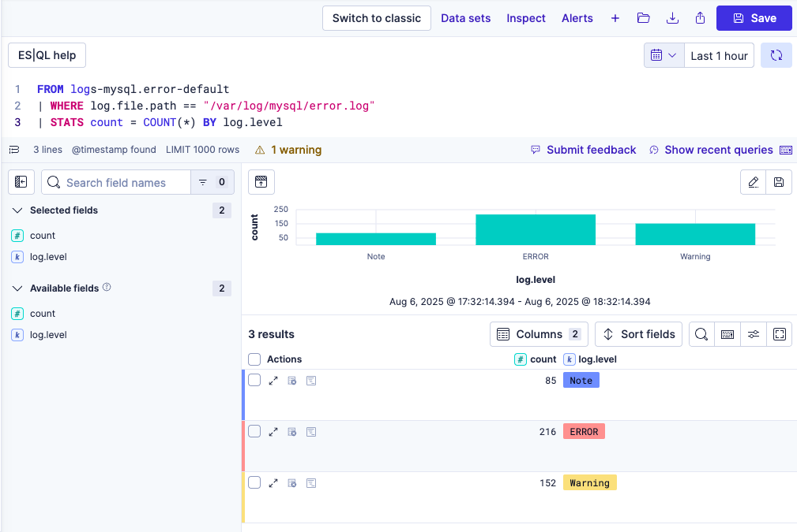

The same query now shows new errors and warnings, giving us a clear before-and-after comparison. Being able to save and reuse queries lets us track how problems evolve and speeds up future investigations.

## Business Health Dashboard

We will continue by checking the overall health of the business using the `Business Health Dashboard` that visualizes critical metrics.

1. Open the `Dashboards` page. The `Business Health Dashboard` should show automatically if that was the last dashboard you viewed.
> [!NOTE]
>  If the `Business Health Dashboard` isn't showing, select it from the list of dashboards.
>  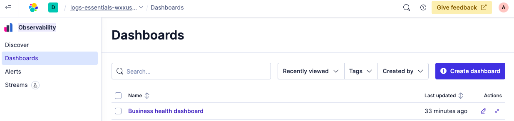
2. We should see the `Business Health Dashboard` now shows an increase in Nginx response code errors as well as MySQL errors, which verifies that this issue is impacting our users and the company's reputation.  We need to find the root cause quick.
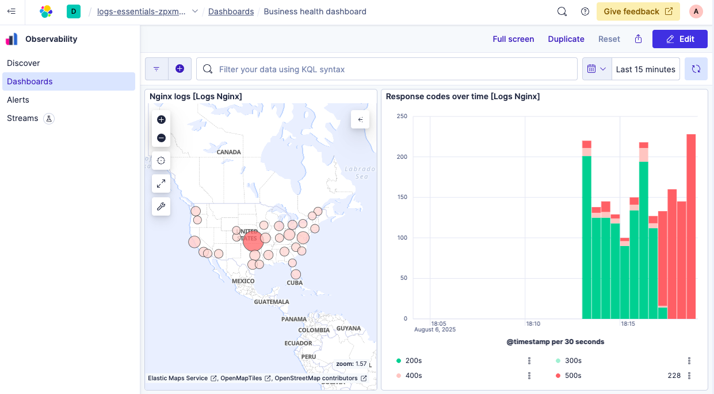

The Business Health Dashboard connects operational signals to business outcomes. It helps you track metrics like geographic distribution of users, HTTP status codes, top web pages, and SQL performance, all derived from logs. This kind of visual insight lets you spot issues before they impact customers.

## Summary
We saw how Elastic Observability Logs Essentials alerted us to the database issue and how this issue is impacting our business health.
