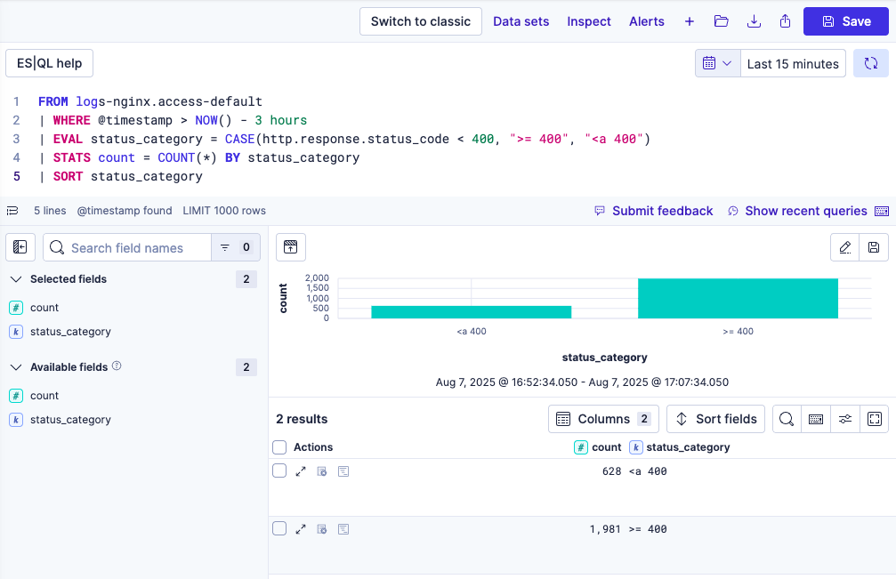
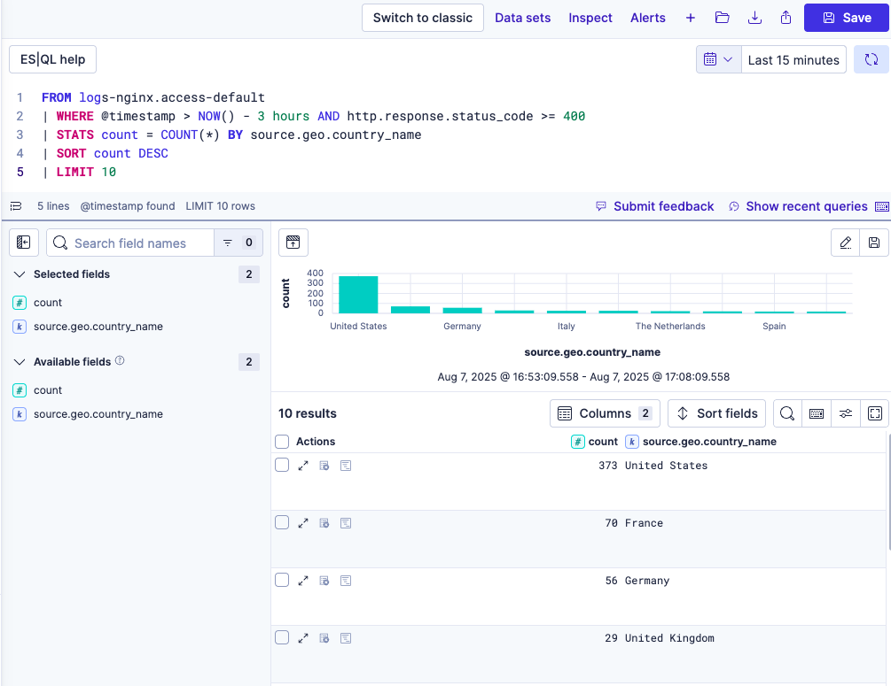
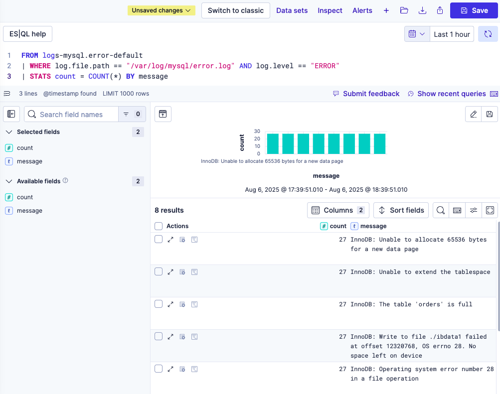
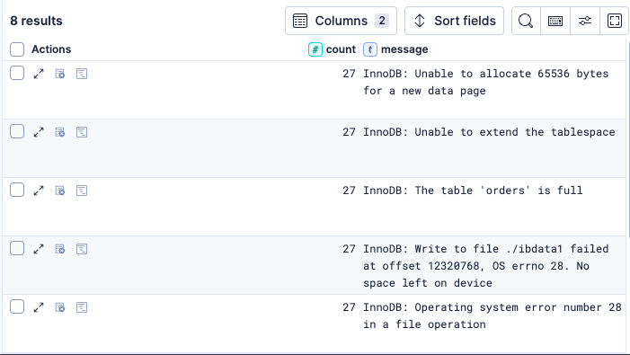
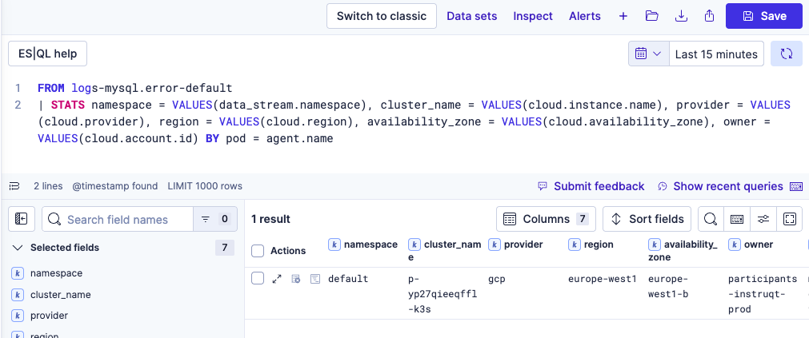

## Check the Frontend for Errors

Now that we have reviewed the alert and see the impact to our business health dashboard, we should determine if the database errors are propigating to the frontend and imacting our users.  Let's run an ES|QL query against our Nginx frontend to see if there are any error HTTP response codes.

1. Run this query to see if there are any http response codes greater than or equal to 400, which indicate users are seeing errors.
```sql
FROM logs-nginx.access-default
| WHERE @timestamp > NOW() - 3 hours
| EVAL status_category = CASE(http.response.status_code < 400, ">= 400", "<a 400")
| STATS count = COUNT(*) BY status_category
| SORT status_category
```


We discovered that users are receiving error responses from the frontend, indicating that the issue is user-facing, which makes it easy to trace backend problems to real-world impact on our users.

## Break Down Errors by Region

Now that we know that users are being impacted.  Let's see if we can determine if the errors are isolated to a specific region or if they are global.

1. Run this query to get a breakdown by country of users experiencing errors.  If multiple regions are returned, we will have confirmation that this issue has a global impact.
```sql
FROM logs-nginx.access-default
| WHERE @timestamp > NOW() - 3 hours AND http.response.status_code >= 400
| STATS count = COUNT(*) BY source.geo.country_name
| SORT count DESC
| LIMIT 10
```


We now have a geographic breakdown of users experiencing errors confirming that this is a global issue. Being able to filter and group by location helps us quickly assess the scope of an incident and prioritize response.

## Find the Root Cause

Now we will examine MySQL logs to identify the root cause with a simple query to cut through the noise.

1. Run this query to get a break down of the errors by message.  Looking at the unique messages should help us find the culprit.
```sql
FROM logs-mysql.error-default
| WHERE log.file.path == "/var/log/mysql/error.log" AND log.level == "ERROR"
| STATS count = COUNT(*) BY message
```

2. Review the messages to see if the root cause stands out.

3. We found the culprit in the message: `InnoDB: Write to file ./ibdata1 failed at offset 12320768, OS errno 28. No space left on device`.  The disk is full on our database. We need to contact the relvant team ASAP to address the disk space issue.

## Kubernetes Information

We know the root cause, but where is the database running? We know it's running on Kubernetes, but which pod, which cluster, how do I find it? All we need to do is run another ES|QL query to find out.

1. Run this query to get the data we need to identify the Kubernetes pod, namespace, cluster, provider, and location.
```sql
FROM logs-mysql.error-default
| STATS namespace = VALUES(data_stream.namespace), cluster_name = VALUES(cloud.instance.name), provider = VALUES(cloud.provider), region = VALUES(cloud.region), availability_zone = VALUES(cloud.availability_zone), owner = VALUES(cloud.account.id) BY pod = agent.name
```


We have now identified the specific pod, namespace, cluster and cloud region where the problem is happening using enriched logs with metadata that helps us move from symptoms to root cause with speed and clarity.

## Summary
In this workshop, we used Elastic Observability Logs Essentials to investigate and resolve a live issue. We saw how logs, search, and context come together to improve speed, clarity, and outcomes. Here’s what we accomplished:

- Reviewed the architecture and log pipeline to build context before jumping into the data
- Monitored business health with dashboards that turn logs into visual insights
- Queried MySQL logs using ES|QL to validate ingestion and save time with reusable queries
- Investigated the alert by pivoting into logs, identifying user impact, analyzing geographic scope, and localizing the issue using Kubernetes and cloud metadata
- Analyzed log messages to quickly isolate the root cause and confirm resolution

Elastic Observability Logs Essentials showed us how search brings speed, precision, and clarity to every step of the incident response.
